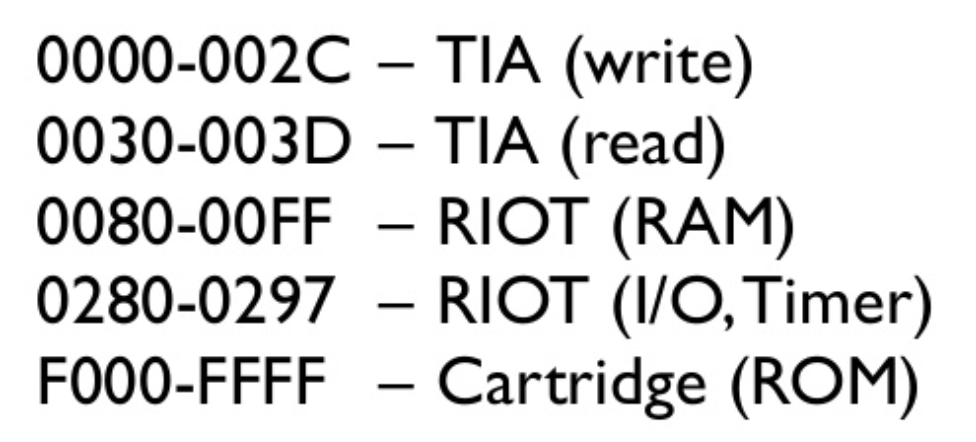
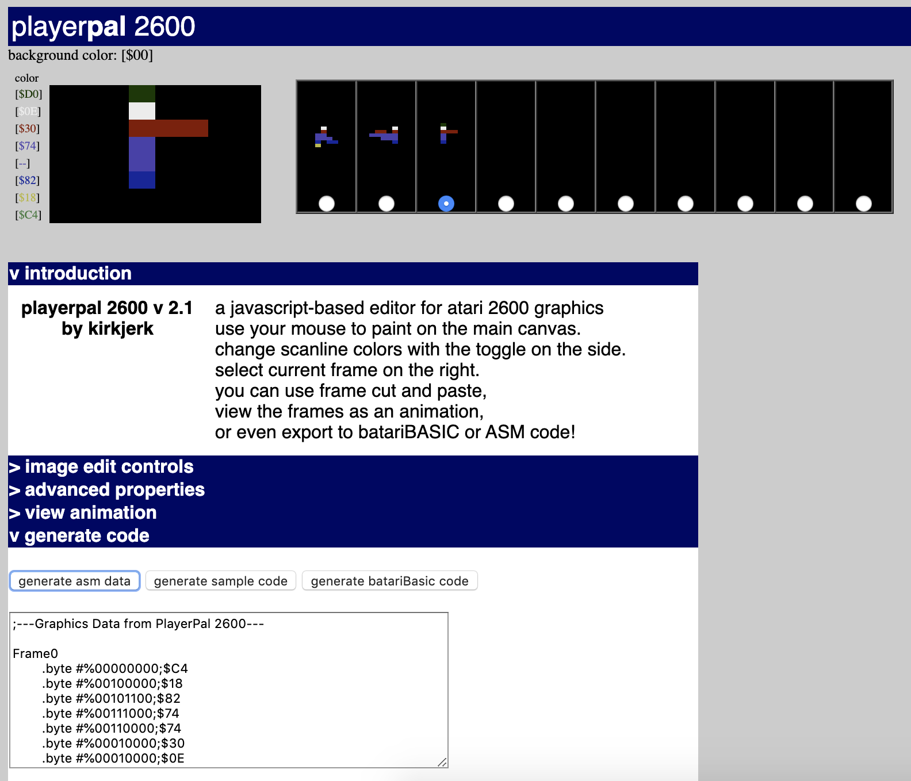
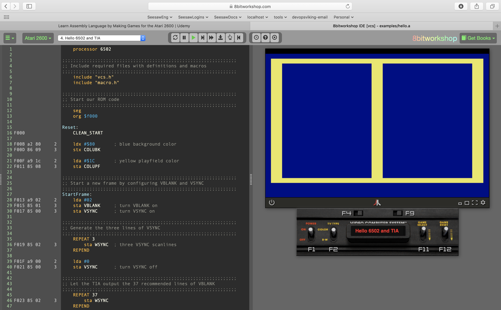

# Atari 6502 Projects
MOS 6502 Atari projects

## Table Of Contents
* [Links](#links)
* [6502.org](#6502org)
* [Eater.net](#eaternet)
* [Random Terrain](#random-terrain-atari-tutorials)
* [Processor Flags](#processor-flags)
* [Atari Memory Map](#atari-memory-map)
* [Development](#development)
  * [Online Development](#online-development)
  * [Offline Development](#offline-development)
    * [DASM Macro Assembler](#dasm-macro-assembler)
    * [Creating the cleanmem machine code binary](#creating-the-cleanmem-machine-code-binary)
    * [Running cleanmem in the Stella emulator](#running-cleanmem-in-the-stella-emulator)
* [Python Helpers](#python-helpers)

## Links
* [Gustavo Pezzi's online "Programming Games for the Atari 2600" course](https://www.udemy.com/course/programming-games-for-the-atari-2600)
* [Stevent Hugg's "Making Games for the Atari 2600" book](https://www.amazon.com/Making-Games-Atari-2600-Steven/dp/1541021304)
* [8 Bit Workshop Browser IDE](https://8bitworkshop.com)
* [DASM Macro Assembler](http://dasm-dillon.sourceforge.net/)
* [Stella Emulator](https://stella-emu.github.io/)
* [JAVATARI](https://javatari.org)
* [8 Bit Workshop](http://8bitworkshop.com)
* [macro.h and vcs.h files](https://github.com/munsie/dasm/tree/master/machines/atari2600)
* [Atari Color Palette](https://en.wikipedia.org/wiki/List_of_video_game_console_palettes#Atari_2600)
* [PlayerPal Online Sprite Creator](https://alienbill.com/2600/playerpalnext.html)
* [Stella Programmers Guide](https://alienbill.com/2600/101/docs/stella.html)

## Eater.net
* [Ben Eater's 6502 electronics kits](https://eater.net/)

## Random Terrain (Atari Tutorials)
* [Let's make a game](https://www.randomterrain.com/atari-2600-lets-make-a-game-spiceware-00.html)
     * [Generate a stable Display](https://www.randomterrain.com/atari-2600-lets-make-a-game-spiceware-01.html)
     * [Timers](https://www.randomterrain.com/atari-2600-lets-make-a-game-spiceware-02.html)
     * [Score and Timer Display](https://www.randomterrain.com/atari-2600-lets-make-a-game-spiceware-03.html)
     * [Line Kernel](https://www.randomterrain.com/atari-2600-lets-make-a-game-spiceware-04.html)
     * [Automate Vertical Delay](https://www.randomterrain.com/atari-2600-lets-make-a-game-spiceware-05.html)
     * [Spec Change](https://www.randomterrain.com/atari-2600-lets-make-a-game-spiceware-06.html)
     * [Draw the Playfield](https://www.randomterrain.com/atari-2600-lets-make-a-game-spiceware-07.html)
     * [Select and Reset Support](https://www.randomterrain.com/atari-2600-lets-make-a-game-spiceware-08.html)
     * [Game Variations](https://www.randomterrain.com/atari-2600-lets-make-a-game-spiceware-09.html)
     * [Random Numbers](https://www.randomterrain.com/atari-2600-lets-make-a-game-spiceware-10.html)
     * [Add the Ball Object](https://www.randomterrain.com/atari-2600-lets-make-a-game-spiceware-11.html)
     * [Add the Missle Objects](https://www.randomterrain.com/atari-2600-lets-make-a-game-spiceware-12.html)
     * [Add Sound Effects](https://www.randomterrain.com/atari-2600-lets-make-a-game-spiceware-13.html)
     * [Add Animation](https://www.randomterrain.com/atari-2600-lets-make-a-game-spiceware-14.html)
* [Atari 2600 programming for newbies](https://www.randomterrain.com/atari-2600-memories-tutorial-andrew-davie-01.html)
    * [Session 1 - Start Here](https://www.randomterrain.com/atari-2600-memories-tutorial-andrew-davie-01.html)
    * [Session 2  - Televsion and Display Basics](https://www.randomterrain.com/atari-2600-memories-tutorial-andrew-davie-02.html)
    * [Session 3 - The TIA and the 6502](https://www.randomterrain.com/atari-2600-memories-tutorial-andrew-davie-03.html)
    * [Session 4 - The TIA](https://www.randomterrain.com/atari-2600-memories-tutorial-andrew-davie-04.html)
    * [Session 5 - Memory Architecture](https://www.randomterrain.com/atari-2600-memories-tutorial-andrew-davie-05.html)
    * [Session 7 - The TV and our Kernel](https://www.randomterrain.com/atari-2600-memories-tutorial-andrew-davie-07.html)
    * [Session 8 - Our first kernel](https://www.randomterrain.com/atari-2600-memories-tutorial-andrew-davie-08.html)
    * [Session 9 - 6502 and DASM - Assembling the Basics](https://www.randomterrain.com/atari-2600-memories-tutorial-andrew-davie-09.html)


## 6502.org
* [Assembly In One Step](https://dwheeler.com/6502/oneelkruns/asm1step.html)
* [NMOS 6502 Opcodes](http://www.6502.org/tutorials/6502opcodes.html)
* [6502 Compare Instructions](http://www.6502.org/tutorials/compare_instructions.html)
* [Overflow Flag](http://www.6502.org/tutorials/vflag.html)
* [Beyond 8-bit Unsigned Comparisons](http://www.6502.org/tutorials/compare_beyond.html)


## Processor Flags
```
   Processor Status
   ----------------
   
   The processor status register is not directly accessible by any 6502 
   instruction.  Instead, there exist numerous instructions that test the 
   bits of the processor status register.  The flags within the register 
   are:
   
   
       bit ->   7                           0
              +---+---+---+---+---+---+---+---+
              | N | V |   | B | D | I | Z | C |  <-- flag, 0/1 = reset/set
              +---+---+---+---+---+---+---+---+
              
              
       N  =  NEGATIVE. Set if bit 7 of the accumulator is set.
       
       V  =  OVERFLOW. Set if the addition of two like-signed numbers or the
             subtraction of two unlike-signed numbers produces a result
             greater than +127 or less than -128.
             
       B  =  BRK COMMAND. Set if an interrupt caused by a BRK, reset if
             caused by an external interrupt.
             
       D  =  DECIMAL MODE. Set if decimal mode active.
       
       I  =  IRQ DISABLE.  Set if maskable interrupts are disabled.
             
       Z  =  ZERO.  Set if the result of the last operation (load/inc/dec/
             add/sub) was zero.
             
       C  =  CARRY. Set if the add produced a carry, or if the subtraction
             produced a borrow.  Also holds bits after a logical shift.
 ```            
        

## Atari Memory Map


## Sprites
Use the [PlayerPal Online Sprite Creator](https://alienbill.com/2600/playerpalnext.html).
<p>
</img>

## Development
You can develop Atari 6502 assembly offline or online (in the browser).

### Online Development

Use the [8 Bit Workshop IDE](https://8bitworkshop.com/) with the built in [Javatari](https://javatari.org) emulator. This solution is very easy to get started.
<p>


### Offline Development
Use the [DASM Macro Assembler](http://dasm-dillon.sourceforge.net/) and the [Stella Emulator](https://stella-emu.github.io/) for local development. It's more powerful than browser development using the 8 Bit Workshop IDE with the Javatari IDE.

#### DASM Macro Assembler
1) Download DASM for mac (or whatever your OS is)
2) Unzip or untar it
3) Sudo copy dasm to /usr/local/bin

#### Creating the cleanmem machine code binary
The `-f3` is the Atari 6507 version.
```
$ dasm cleanmem.asm -f3 -v0 -ocart.bin
$ chmod a+x cart.bin
```

#### Running cleanmem in the Stella emulator
```
$ alias stella="/Applications/Stella.app/Contents/MacOS/Stella"
$ cd colorbg
$ make
$ stella cart.bin
```
OR
1) Open the Stella emulator
2) Select the path to your cart.bin file
3) Double click on cart.bin
4) Enter the backtick (\`) to toggle between debug mode.


## Python Helpers
View binary representation of a number:
```python
b = lambda x: '{0:08b}'.format(x)
h = lambda x: '{0:08x}'.format(x)
b16 = lambda x: '{0:016b}'.format(x)
h16 = lambda x: '{0:016x}'.format(x)
b32 = lambda x: '{0:032b}'.format(x)
h32 = lambda x: '{0:032x}'.format(x)

Examples:
>>> b8(10 ^ 5)
'00001111'
>>> h8(0b1010 ^ 0b0101)
'0000000f'


x << y
Returns x with the bits shifted to the left by y places (and new bits on the right-hand-side are zeros). This is the same as multiplying x by 2**y.
x >> y
Returns x with the bits shifted to the right by y places. This is the same as //'ing x by 2**y.
x & y
Does a "bitwise and". Each bit of the output is 1 if the corresponding bit of x AND of y is 1, otherwise it's 0.
x | y
Does a "bitwise or". Each bit of the output is 0 if the corresponding bit of x AND of y is 0, otherwise it's 1.
~ x
Returns the complement of x - the number you get by switching each 1 for a 0 and each 0 for a 1. This is the same as -x - 1.
x ^ y
Does a "bitwise exclusive or". Each bit of the output is the same as the corresponding bit in x if that bit in y is 0, and it's the complement of the bit in x if that bit in y is 1.
```
